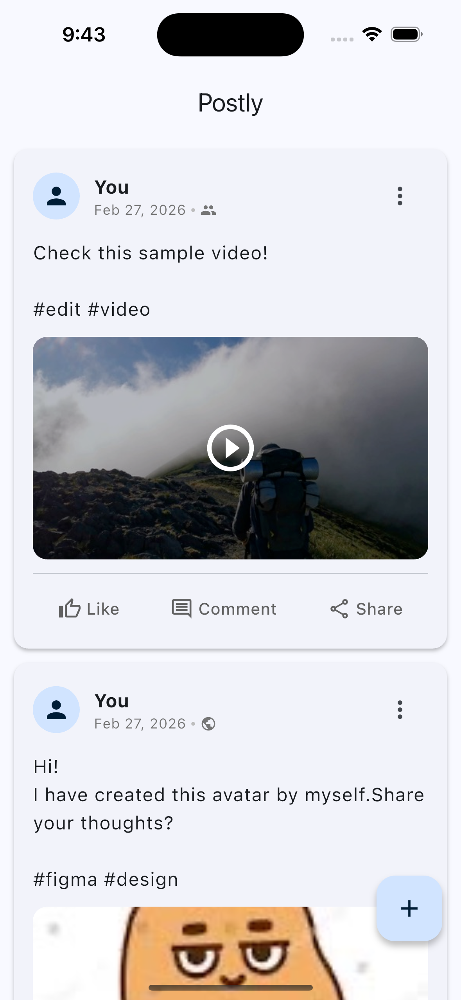
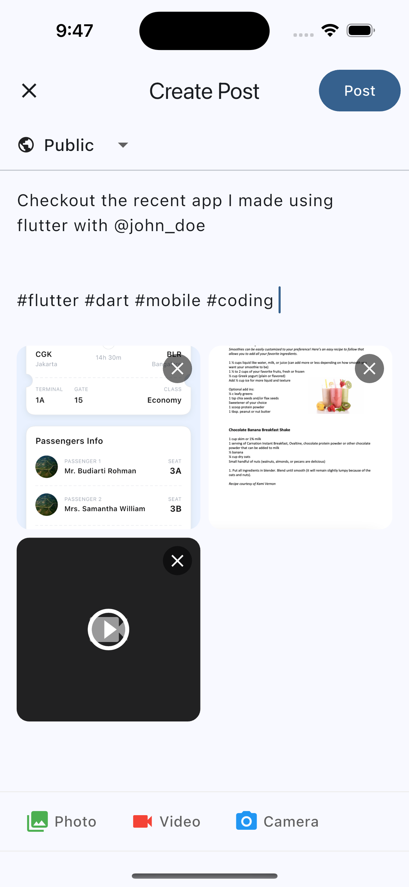

# Postly

A modern social media app built with Flutter that allows users to create and share posts with rich media content.

## Features

- **Feed Screen**: Browse through posts in a clean, card-based layout
- **Create Posts**: Compose posts with text, hashtags, and @mentions
- **Media Support**: Attach photos and videos from your gallery or camera
- **Video Playback**: Full-screen video player with playback controls
- **Visibility Controls**: Set post visibility (Public, Friends, Private)
- **Hashtag & Mention Suggestions**: Auto-suggestions while typing

## Screenshots

| Feed | Create Post | Video Player |
|:----:|:-----------:|:------------:|
|  |  |  |

## Tech Stack

- **Framework**: Flutter
- **State Management**: Riverpod
- **Media**: image_picker, video_player, video_thumbnail
- **Storage**: shared_preferences, path_provider
- **Utilities**: uuid, intl

## Project Structure

```
lib/
├── app.dart
├── main.dart
├── core/
│   ├── constants/
│   ├── theme/
│   └── utils/
└── features/
    └── post/
        ├── data/
        │   ├── datasources/
        │   ├── models/
        │   └── repositories/
        └── presentation/
            ├── providers/
            ├── screens/
            └── widgets/
```

## Getting Started

### Prerequisites

- Flutter 3.38.2 or higher
- Dart SDK

### Installation

1. Clone the repository:
   ```bash
   git clone https://github.com/yourusername/postly_app.git
   ```

2. Navigate to the project directory:
   ```bash
   cd postly_app
   ```

3. Install dependencies:
   ```bash
   flutter pub get
   ```

4. Run the app:
   ```bash
   flutter run
   ```

## License

This project is licensed under the MIT License.